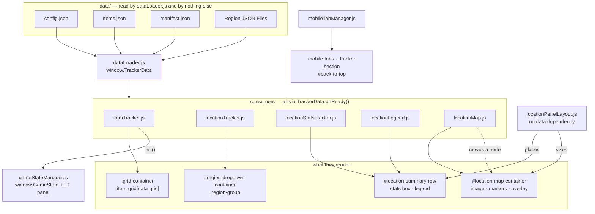
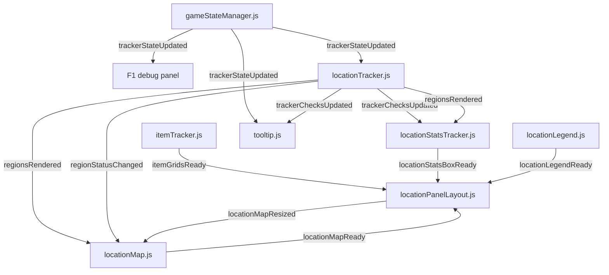
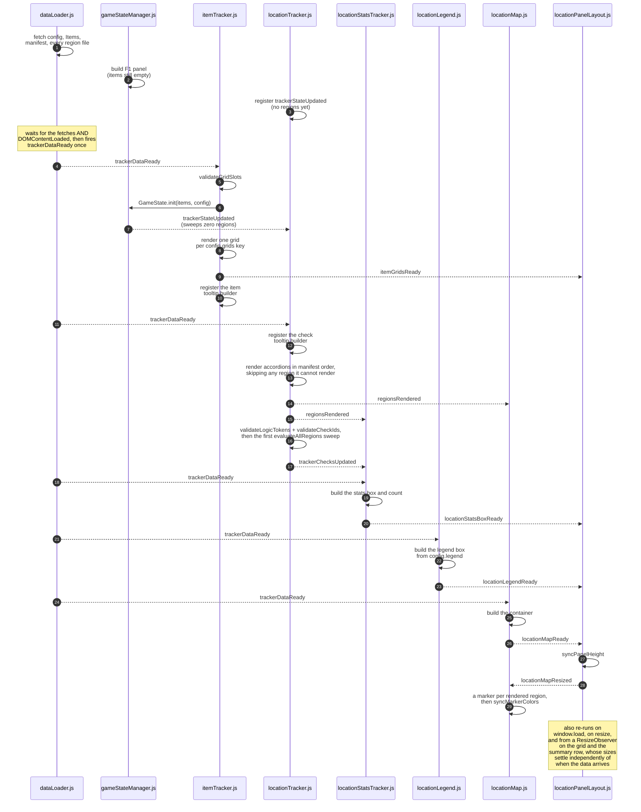
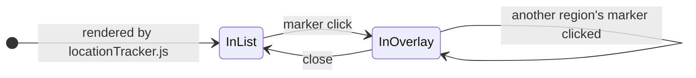

# MM3D Randomizer Tracker — Diagrams

Companion to [`ARCHITECTURE.md`](ARCHITECTURE.md). Five views:

1. [Components and data](#1-components-and-data)
2. [The event bus](#2-the-event-bus)
3. [Load / init sequence](#3-load--init-sequence)
4. [Desktop: moving a region into the map overlay](#4-desktop-region--overlay-move)
5. [The tooltip and logic stack](#5-the-tooltip-and-logic-stack)

Components and events are drawn separately on purpose. One graph with both is
twenty-odd crossing edges, where a wrong one is easier to miss than a right one is
to read.

---

## 1. Components and data

Who reads what, and who renders what. No events here — those are in §2.

Legend: solid arrow = reads from, or renders into. Dotted = moves a live DOM node
rather than creating one.

The three shared helpers — `logicParser.js`, `requirementsView.js`, `tooltip.js` —
are left out here and drawn in §5. They point the opposite way to everything on
this graph: the trackers call *them*, so putting them in this one costs four
edges that cross it end to end.

`locationPanelLayout.js` has no data dependency by design — the map's aspect ratio
is handed to it on `locationMapReady` instead, so it can never be left waiting on
a fetch before it can size anything.

---

## 2. The event bus

Every event is a `CustomEvent` on `window`. **Nothing observes the DOM** —
there is no `MutationObserver` anywhere in the codebase, and `ARCHITECTURE.md`'s
event bus section says why not.

`trackerDataReady` is left out of this graph: it is the fan-out to every consumer
already drawn in §1, and drawing it here costs a long edge per consumer, each
crossing everything else. What follows is what happens *after* load.

Payloads are deliberately not on the edges — they live in the event bus table in
`ARCHITECTURE.md`, and repeating them here costs more legibility than it buys.

`tooltip.js` listens to both state events for one reason: what sits under a
stationary pointer changes without the pointer moving. Clicking an item advances
that slot and re-runs the sweep, so an open tooltip would otherwise keep
describing the state before the click.

Two of these are worth reading twice:

- **`regionStatusChanged`** exists because a watcher cannot see the open region.
  That region's node has been *moved out* of `#region-dropdown-container` into the
  overlay, so anything watching that container misses it and its marker holds a
  stale color until you close it.
- **`locationMapResized`** runs the opposite way to every other event here: the
  layout file telling the map file it has just been resized. Listening for this
  rather than racing it on `resize` is what makes the refit correct regardless of
  which file registered its listener first, and it is the only signal at all when
  the `ResizeObserver` on `.grid-container` resizes the map with no window resize
  involved.

Two files also listen off this bus, to browser events rather than to each other.
`locationPanelLayout.js` re-runs its sizing on `window.load`, on `resize`, and
from a `ResizeObserver` on `.grid-container` and the summary row. `locationMap.js` re-fits an open
overlay on `resize`, and closes one on a `matchMedia` change into mobile — that
last listener is the only thing handing a checked-out region back to the list when
the window narrows across the breakpoint, so it is load-bearing despite not being
drawn here.

---

## 3. Load / init sequence

`dataLoader.js` fetches everything once and holds `trackerDataReady` until the
data **and** `DOMContentLoaded` are both done. Consumers register via
`TrackerData.onReady(...)` at parse time, so they fire in `index.html` script
order and the sequence is deterministic.

The validators and the region-dropping step all warn to the console and let
everything else carry on — see `ARCHITECTURE.md`, *When the data is wrong*. The
handoff and the first sweep sit in a `finally`, so a region file that breaks
mid-render costs that one region rather than everything after it.

**Some arrows are drawn where they are sent, not where they land.** The two
`regionsRendered` edges and the first `trackerChecksUpdated` reach nobody: both
receiving files register their listeners inside their own `TrackerData.onReady`,
which runs later in this sequence. Nothing is lost, because each does the
equivalent work during its own init. Those listeners exist to catch a region
rendered *after* load, which nothing does today.

The load-time `locationMapResized` is the same: `locationPanelLayout.js` answers
`locationMapReady` straight away, before `locationMap.js` has registered its
listener. Nothing is lost there either, since no overlay can be open yet.

---

## 4. Desktop: region ↔ overlay move

On desktop `#region-sidebar` is `display: none`. `locationMap.js` physically
**moves** the live `.region-group` node between the hidden list and the overlay,
so its event bindings and class state survive the trip.

**Going in** (`openOverlayFor`): remember `nextElementSibling` as the return
anchor, move the node into `.location-map-overlay-body`, force `.region-content`
open, then `fitOverlayContent()` picks the column count and text size.

**Coming out** (`closeOverlay`), triggered by the X, anywhere on the titlebar, the
same marker again, another marker, or crossing to mobile: reset the accordion
state, clear the inline styles `fitOverlayContent()` set, then put the node back
**in front of its return anchor** — not on the end, which is invisible on desktop
and obvious the moment you narrow the window.

The self-transition is a swap: clicking a different region's marker closes the
current overlay (returning that region to the list) before opening the new one,
so only one is ever out at a time.

Consequences of the node moving:

- Anything counting checks must query **globally** (`.region-check-item`), never
  scoped to `#region-dropdown-container` — the region in question may be in the
  overlay. `locationStatsTracker.js` does exactly this.
- Anything reacting to those checks changing must listen for
  `trackerChecksUpdated`, for the same reason (§2).
- Anything binding to those checks must **delegate from `document`** rather than
  listening per element. `tooltip.js` does, which is why a check hovered inside
  the overlay behaves the same as one in the list, with nothing rebound on the
  move.
- `regionLookup` in `locationMap.js` is additive-only. Rebuilding it by
  re-scanning the container would silently drop whichever region is currently
  checked out, leaving that marker gray for good.

---

## 5. The tooltip and logic stack

Three helpers that depend on nothing else, drawn apart from §1 because the arrows
run the other way: the trackers call these rather than being fed by them.

**The loop is the design.** A tracker registers a selector, and `tooltip.js`
calls back into that tracker when one of its elements is hovered. So the tooltip
owns position, delay and the edge flip, and knows nothing about items or logic;
each tracker keeps its own knowledge and hands back a finished node. That is why
one element serves both song notes and check requirements.

`locationTracker.js` parses a check's logic with `logicParser.js` and annotates
it against the current inventory, then `requirementsView.js` turns that annotated
tree into the bullet list. The same parser evaluates the check for the sweep, so
the tooltip cannot explain a check by different rules than the ones that colored
it.

Binding is delegated from `document`, not per element — the region a check lives
in may have been moved into the map overlay (§4), and delegation survives that
with nothing rebound.

On touch there is no hover, so each check carries a button that pins the panel to
the bottom of the screen. Same registration, same builder; only the placement and
the dismissal differ. See ARCHITECTURE.md, *Tooltips*.
