# MM3D Randomizer Tracker — Diagrams

Companion to [`ARCHITECTURE.md`](ARCHITECTURE.md). Five views:

1. [Pages, components and data](#1-pages-components-and-data)
2. [The event bus](#2-the-event-bus)
3. [Load / init sequence](#3-load--init-sequence)
4. [Desktop: moving a region into the map overlay](#4-desktop-region--overlay-move)
5. [The tooltip and logic stack](#5-the-tooltip-and-logic-stack)

---

## 1. Pages, components and data

The two pages, then who reads what, then who renders what. No events here —
those are in §2.

### The two pages

The settings page is where a visitor lands. The settings cross to the tracker in
`sessionStorage`, which belongs to the tab, and come back the same way to prefill
the settings page.

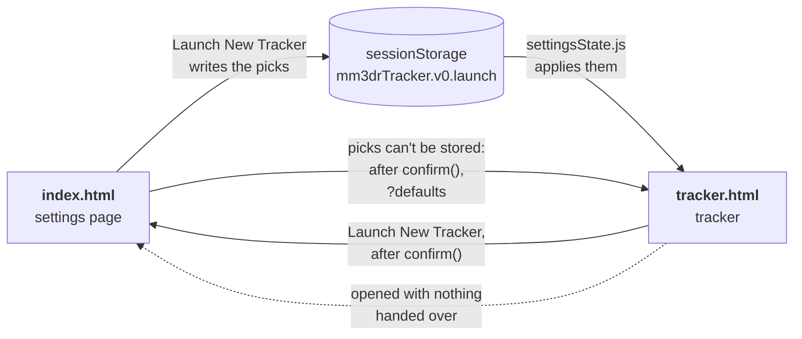

Legend: dotted = `launch.js` redirecting before the page draws. A tracker opened
with `?defaults` never redirects, and opens on the default settings.

### Who reads what

Nothing reads `data/` but `dataLoader.js`, and every consumer waits for it through
`TrackerData.onReady()`.

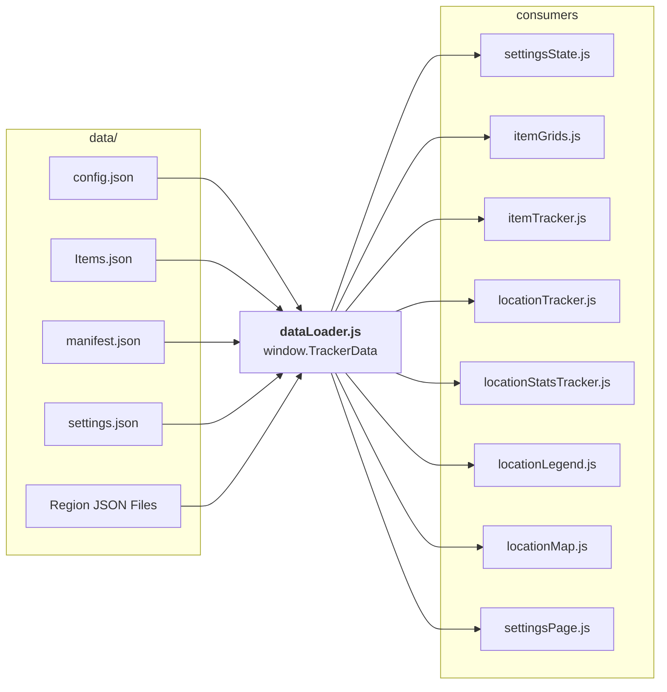

On the settings page `settingsState.js`, `itemGrids.js` and `settingsPage.js` wait
for the data, and `dataLoader.js` leaves the region files out.

### Who renders what

On the tracker, what each file reads from the others:

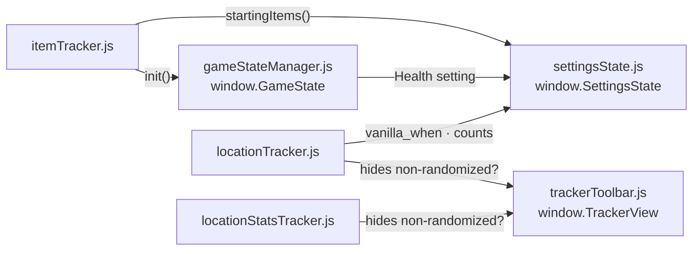

And what each one renders into:

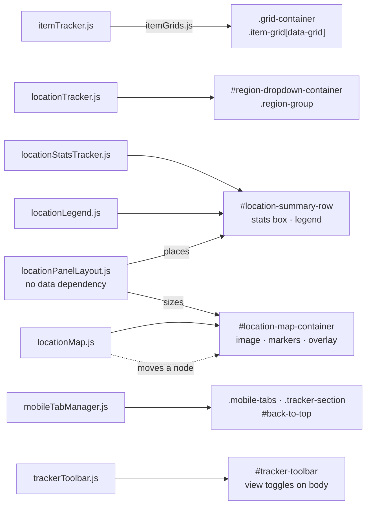

Legend: solid arrow = reads, calls or renders into. Dotted = moves a live DOM
node rather than creating one.

The settings page, in the same terms. What it reads:

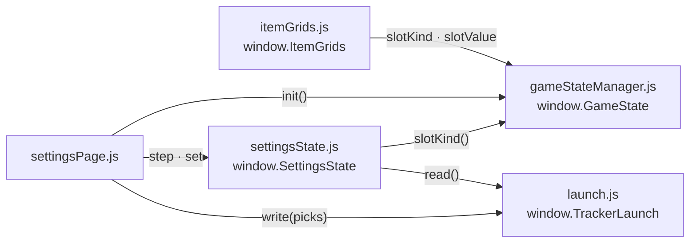

And what it renders into:

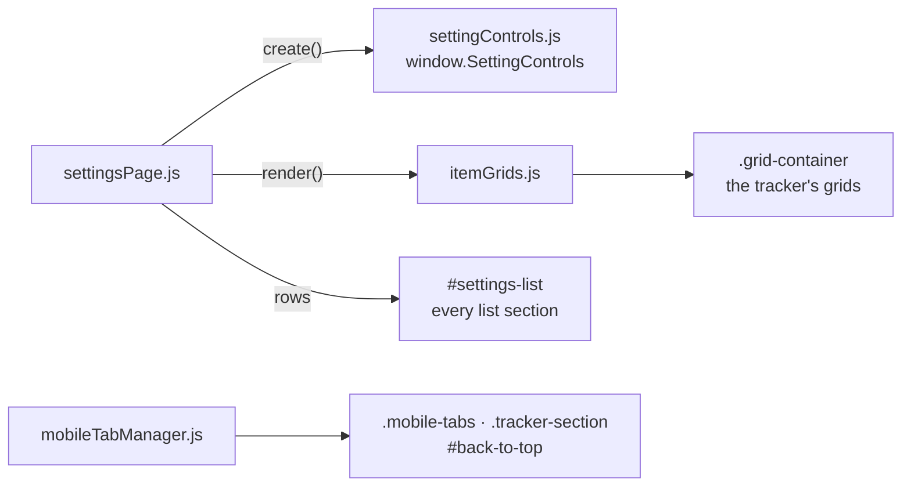

The settings page's `init()` is not a tracker starting up: it re-runs on every
change so the grids show the state the tracker will open with.

The three shared helpers — `logicParser.js`, `requirementsView.js`, `tooltip.js` —
are in §5.

`locationPanelLayout.js` has no data dependency by design — the map's aspect ratio
is handed to it on `locationMapReady` instead, so it can never be left waiting on
a fetch before it can size anything.

---

## 2. The event bus

Every event is a `CustomEvent` on `window`. **Nothing observes the DOM** —
there is no `MutationObserver` anywhere in the codebase, and `ARCHITECTURE.md`'s
event bus section says why not.

`trackerDataReady` reaches every consumer in §1, at load (§3). This is what
happens *after* load.

**State.** An item click, the toolbar, and the sweep they set off.

An item changes:

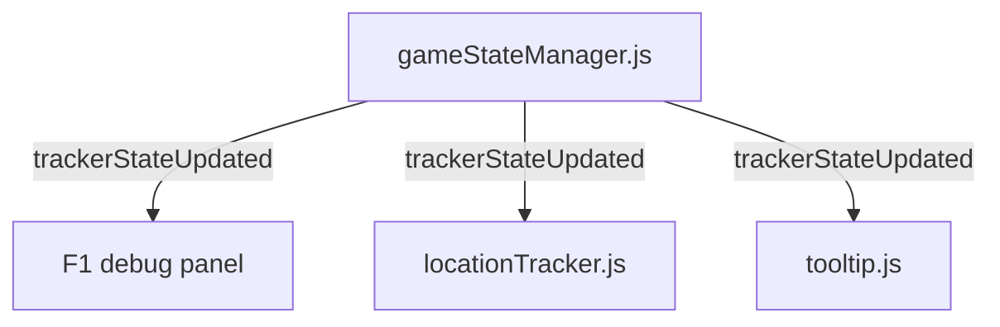

A view toggle flips, the tab switches, or the map overlay closes a region:

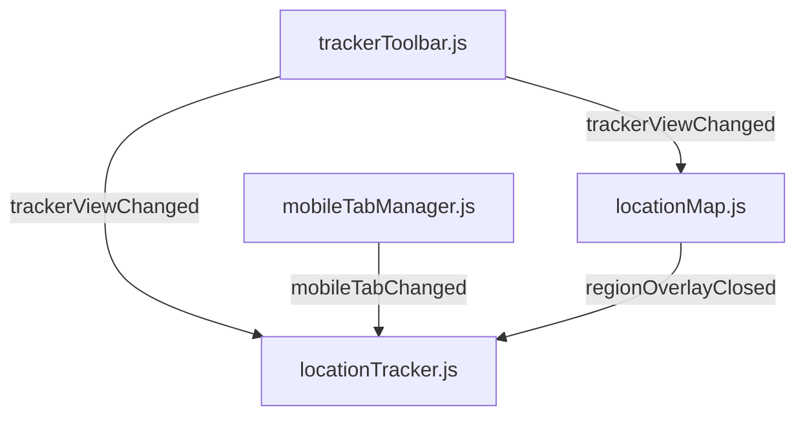

The sweep finishes, or the regions first render:

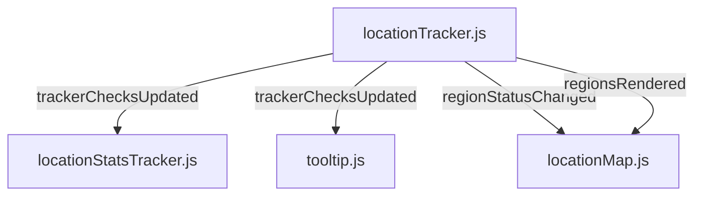

**Layout.** The item grids, both boxes and the map hand themselves to
`locationPanelLayout.js`, which answers with the map's new size:

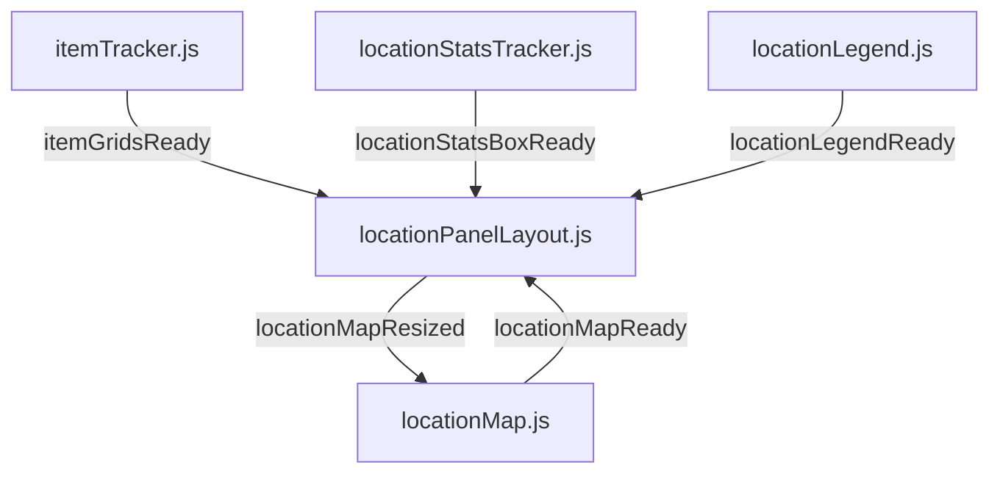

What each event carries is in the event bus table in `ARCHITECTURE.md`.

The settings page has one event of its own: `settingsState.js` announces
`settingsChanged` on every pick and on a reset, and `settingsPage.js` redraws its
controls, counts, lock notes and grid slots.

`tooltip.js` listens to both state events for one reason: what sits under a
stationary pointer changes without the pointer moving. Clicking an item advances
that slot and re-runs the sweep, so an open tooltip would otherwise keep
describing the state before the click. The same redraw closes a tooltip whose
check is no longer drawn, which is how one closes when a view toggle hides its
check: the toggle sets off a sweep, and the sweep ends in `trackerChecksUpdated`.

Two of these are worth reading twice:

- **`regionStatusChanged`** exists because a watcher cannot see the open region.
  That region's node has been *moved out* of `#region-dropdown-container` into the
  overlay, so anything watching that container misses it and its marker holds a
  stale color until you close it.
- **`locationMapResized`** runs the opposite way to every other event here: the
  layout file telling the map file it has just been resized. Listening for this
  rather than racing it on `resize` is what makes the refit correct regardless of
  which file registered its listener first, and it is the only signal at all when
  the `ResizeObserver` on `.grid-container` resizes the map with no window resize
  involved.

Some files also listen to the browser rather than to each other.
`locationPanelLayout.js` re-runs its sizing on `window.load`, on `resize`, and
from a `ResizeObserver` on `.grid-container` and the summary row, and
`locationMap.js` re-fits an open overlay on `resize`. Crossing the breakpoint is a
`matchMedia` change: `locationMap.js` closes an open overlay, the only thing that
hands a checked-out region back to the list when the window narrows;
`locationPanelLayout.js` moves the summary row and the map; and on the settings
page `settingsPage.js` moves the inventory options block. `tooltip.js` closes a
pinned panel on `resize` once its button is no longer drawn.

---

## 3. Load / init sequence

`dataLoader.js` fetches everything once and holds `trackerDataReady` until the
data **and** `DOMContentLoaded` are both done. Consumers register via
`TrackerData.onReady(...)` at parse time, so they fire in `tracker.html` script
order and the sequence is deterministic.

Before any of it, `launch.js` in the page head has sent a tracker with no settings
handed over to the settings page. While the rest of the page parses,
`gameStateManager.js` builds the empty F1 panel, `trackerToolbar.js` applies both
saved view toggles, and `locationTracker.js` starts listening for
`trackerStateUpdated`.

**Settings and items.**

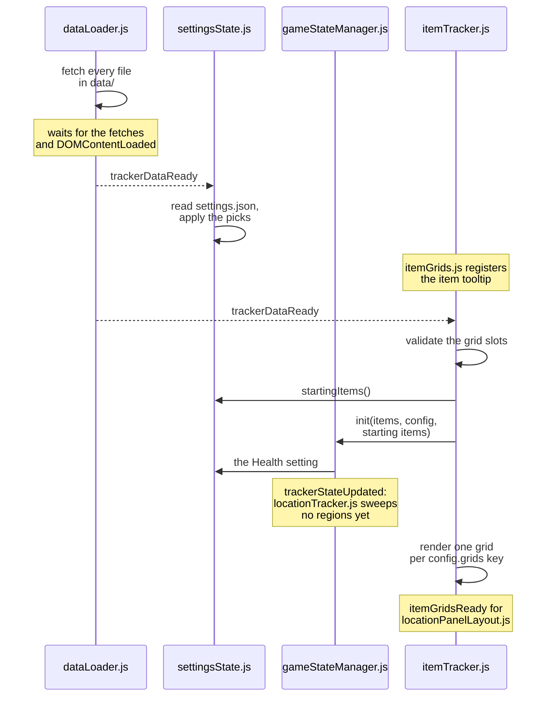

**Regions.**

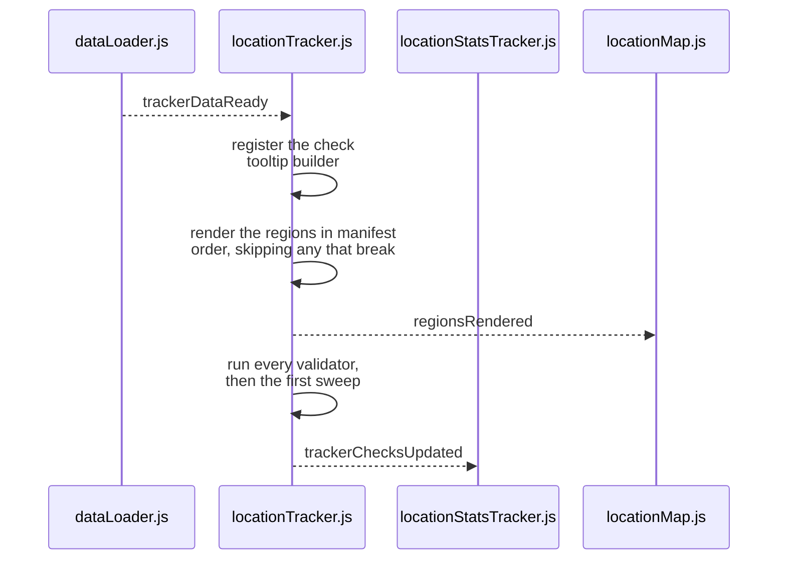

**The boxes and the map.**

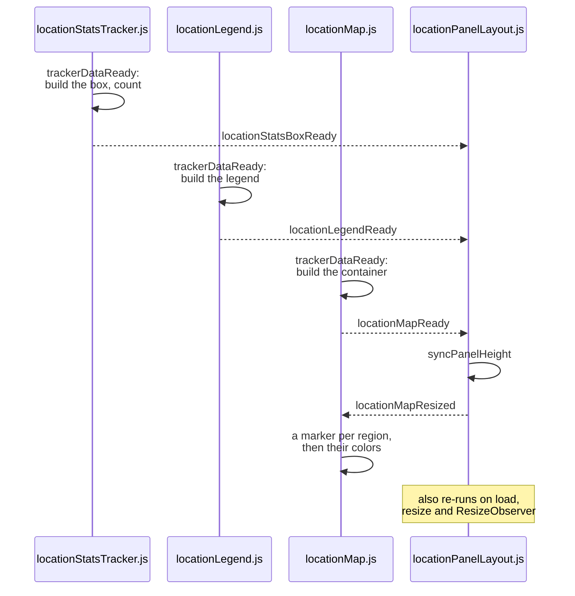

The validators and the region-dropping step all warn to the console and let
everything else carry on — see `ARCHITECTURE.md`, *When the data is wrong*. The
handoff and the first sweep sit in a `finally`, so a region file that breaks
mid-render costs that one region rather than everything after it.

**Some arrows are drawn where they are sent, not where they land.** The
`regionsRendered` edge and the first `trackerChecksUpdated` reach nobody: both
receiving files register their listeners inside their own `TrackerData.onReady`,
which runs later in this sequence. Nothing is lost, because each does the
equivalent work during its own init. Those listeners are there for a region
rendered after load.

The load-time `locationMapResized` is the same: `locationPanelLayout.js` answers
`locationMapReady` straight away, before `locationMap.js` has registered its
listener. Nothing is lost there either, since no overlay can be open yet.

---

## 4. Desktop: region ↔ overlay move

On desktop `#region-sidebar` is `display: none`. `locationMap.js` physically
**moves** the live `.region-group` node between the hidden list and the overlay,
so its event bindings and class state survive the trip.

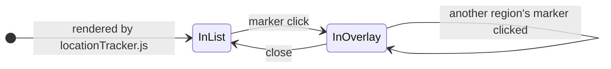

**Going in** (`openOverlayFor`): remember `nextElementSibling` as the return
anchor, move the node into `.location-map-overlay-body`, force `.region-content`
open, then `fitOverlayContent()` picks the column count and text size.

**Coming out** (`closeOverlay`), triggered by the X, anywhere on the titlebar, the
same marker again, another marker, or crossing to mobile: reset the accordion
state, clear the inline styles `fitOverlayContent()` set, then put the node back
**in front of its return anchor** — not on the end, which is invisible on desktop
and obvious the moment you narrow the window. Last, it announces
`regionOverlayClosed`, and `locationTracker.js` lets that region's kept rows go,
as a header click would.

The self-transition is a swap: clicking a different region's marker closes the
current overlay (returning that region to the list) before opening the new one,
so only one is ever out at a time.

Consequences of the node moving:

- Anything counting checks must query **globally** (`.region-check-item`), never
  scoped to `#region-dropdown-container` — the region in question may be in the
  overlay. `locationStatsTracker.js` does exactly this.
- Anything reacting to those checks changing must listen for
  `trackerChecksUpdated`, for the same reason (§2).
- Anything binding to those checks must **delegate from `document`** rather than
  listening per element. `tooltip.js` does, which is why a check hovered inside
  the overlay behaves the same as one in the list, with nothing rebound on the
  move.
- `regionLookup` in `locationMap.js` is additive-only. Rebuilding it by
  re-scanning the container would silently drop whichever region is currently
  checked out, leaving that marker gray for good.

---

## 5. The tooltip and logic stack

Three helpers that depend on nothing else. The trackers call these, and they only
call back into a tracker through a function that tracker handed them.

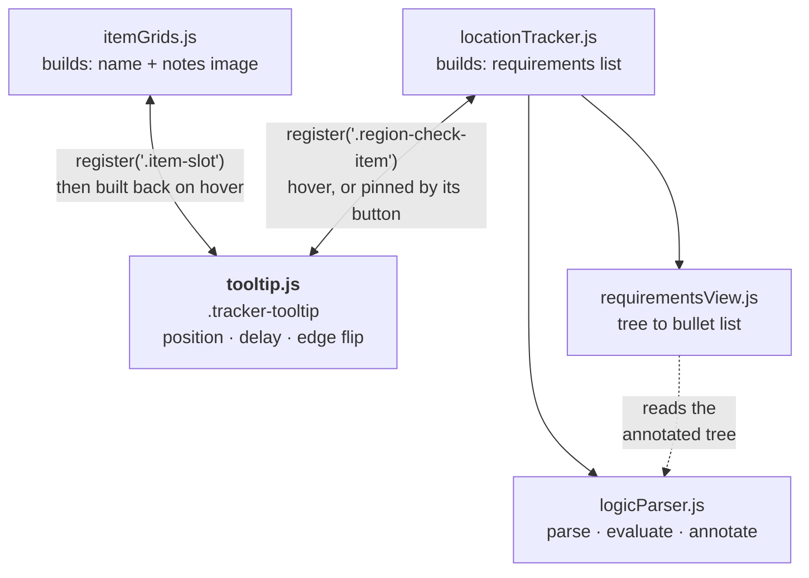

**The loop is the design.** A file registers a selector, and `tooltip.js` calls
back into that file when one of its elements is hovered. So the tooltip owns
position, delay and the edge flip, and knows nothing about items or logic; each
owner keeps its own knowledge and hands back a finished node. That is why one
element serves both song notes and check requirements.

`locationTracker.js` parses a check's logic with `logicParser.js` and annotates
it against the current inventory and settings, then `requirementsView.js` turns that annotated
tree into the bullet list. The same parser evaluates the check for the sweep, so
the tooltip cannot explain a check by different rules than the ones that colored
it.

Binding is delegated from `document`, not per element — the region a check lives
in may have been moved into the map overlay (§4), and delegation survives that
with nothing rebound.

On touch there is no hover, so each check carries a button that pins the panel to
the bottom of the screen. Same registration, same builder; only the placement and
the dismissal differ. See ARCHITECTURE.md, *Tooltips*.
